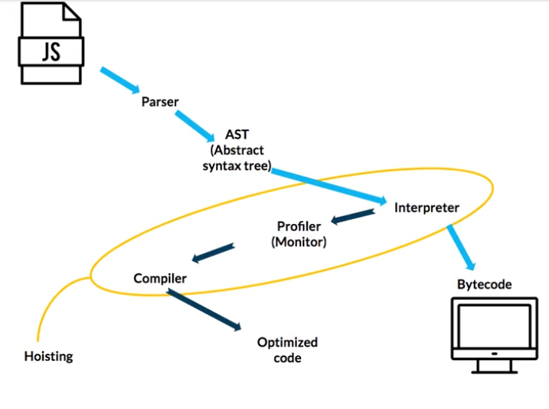
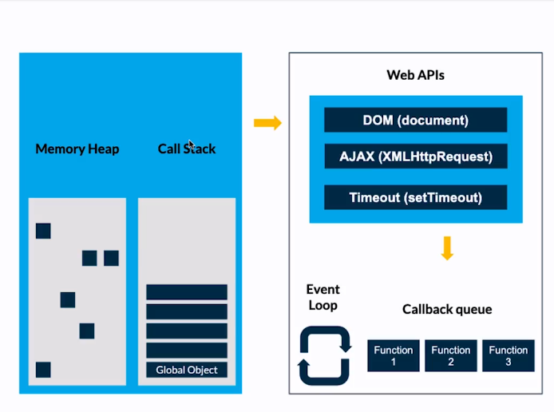

## JavaScript Engine

- Es el motor de JavaScript.
- Una explicación visual de JavaScript
  Engine https://dev.to/lydiahallie/javascript-visualized-the-javascript-engine-4cdf

  

## V8

- V8 Es el Motor de JavaScript de Chrome

  

- **Porque nace V8**: porque google queria que google maps se ejecutara mas rapido y que no se este teniendo una mala
  experiencia en su applicación. Con la creación de este motor se podria crear aplicaciones mas robustas.
- Con este motor se pudo crear nodejs y hacer que javascript se ejecutara en el servidor.
- Lista de ECMAScript Engines - https://en.wikipedia.org/wiki/List_of_ECMAScript_engines

### Ejecutar un archivo JS

- Se crear un entorno global
    - Se crea el objeto window (Global Object)
    - Genera una variable this que hace referencia a Window
    - Genera el contexto de ejecucion
    - Corre nuestro codigo con un stack de tareas que lo va apilando 1x1
      
      

- AST (Abstract syntax tree) - https://astexplorer.net/

### Memory heap

### Call stack

- Ejemplo

### Garbage collection

- Limpia la memoria de los datos no utilizados para no sobrecargarla y seguir trabajando sin problemas.

  

  

### Stack overflow

- El stack overflow es llenar de tareas el call stack y si sucede eso el navegador se detiene, cuelga, crashea.
- Chrome implemento un limite para que no suceda un stack overflow.
  

### JavaScript Runtine

- El EventLoop es una especio de **watcher** u observador que mueve las tareas de callback queue haca el call stack una
  vez que esta vacio para que sean ejecutados.
  