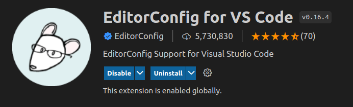
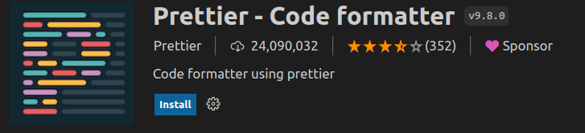
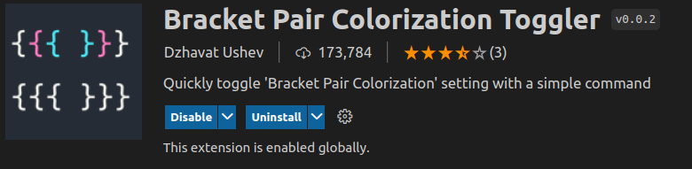
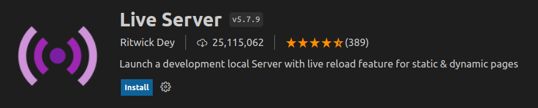

## Herramientas

## Editor de Codigo

- [Visual studio Code](https://code.visualstudio.com/download)

## IDE - Herramientas de desarrollo

[https://www.jetbrains.com/es-es/idea/download/#section=linux](https://www.jetbrains.com/es-es/idea/download/#section=linux)

## Editores online

- [https://jsconsole.com/](https://jsconsole.com/)
- [https://reply.io](https://reply.io/?gspk=RGF2aWRLdWxtYW4%3D&gsxid=E32BR7JNLGnw)
- [https://jsbin.com](https://jsbin.com/?html,output)
- [https://codepen.io/](https://codepen.io/)

### Visual Studio Code

- Instalar plugin EditorConfig for VS Code
  
- Instalar plugin Prettier - Code formatter
  

> para formatera se utiliza shift+alt+f

- Instalar plugin Bracket Pair Colorization Toggler
  
- Instalar plugin Live server
  

## Paginas

- [https://developer.mozilla.org/es/](https://developer.mozilla.org/es/)
- [https://www.w3schools.com/](https://www.w3schools.com/)

## Plugins de VCode

- https://marketplace.visualstudio.com/items?itemName=formulahendry.code-runner

## Servidores locales

```javascript
npm
install - g
htttp - serve
npm
install - g
http - serve - spa
```
