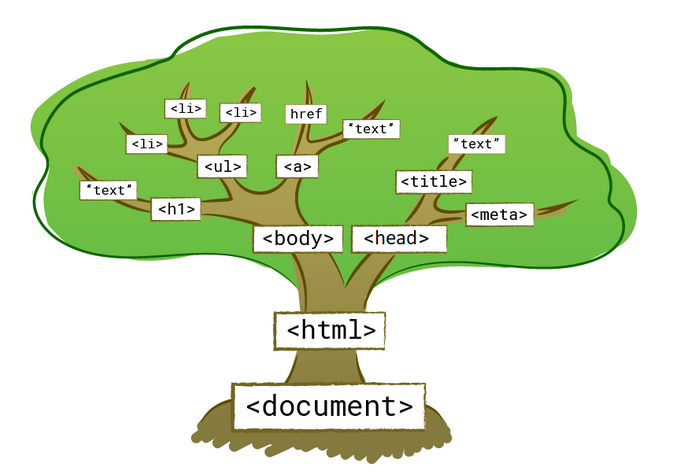
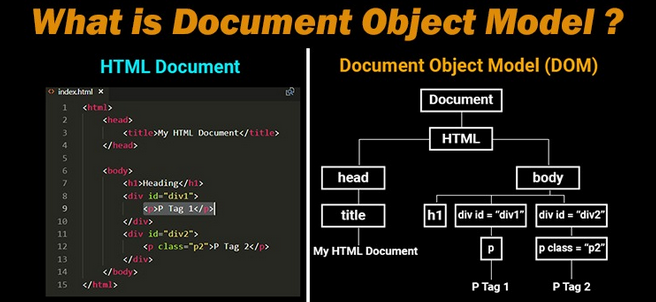
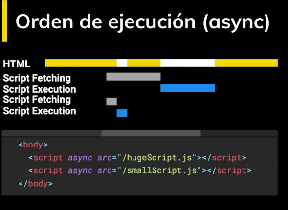
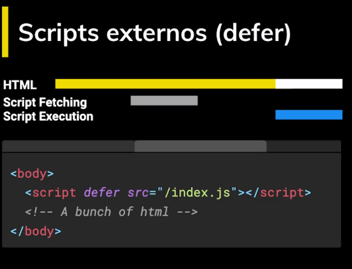

# DOM

- DOM - Document object Model
- DOM → Es la estructura jerárquica (similar a un árbol genealógico) que representa nuestro documento web en forma de
  esquema. Este esquema contiene todos los nodos (TAGs) que compone una página HTML.

```html
<!doctype html>
<html lang="en">
<head>
    <meta charset="UTF-8">
    <meta name="viewport"
          content="width=device-width, user-scalable=no, initial-scale=1.0, maximum-scale=1.0, minimum-scale=1.0">
    <meta http-equiv="X-UA-Compatible" content="ie=edge">
    <title>Document</title>
</head>
<body>
<h1>DOM</h1>
<p>Cuando llega el HTML al browser, ese lo empieza a recorrer.
    va leyendo etiqueta por etiqueta y va creando el DOM.
    Cuando termina por completo este proceso termina por completo es cuando
    obtenemos el evento DOMContentLoaded.</p>
</body>
</html>
```





> Nota: Cuando termina el navegador de convertir al DOM ocurre el evento DOMContentLoaded a partir de este punto tenemos
> la garantia que todo nuestro documento se ha cargado.

## Scripts externos o embebidos

- Es importante que los scripts siempre esten al final del todas las etiquetas HTML. Porque sino es asi ocupan espacio
  de carga
  al leer el DOM.

# Script con el atributo async

- Con async podemos hacer la peticion de forma asincrona y no se detenera la carga del DOM hasta que se haga la
  ejecucion del codigo.



# Script con el atributo defer

- Es igual que async al ser asincrono con la diferencia que la ejecucion del javascript se ejecuta al final de la carga
  total de DOM.

