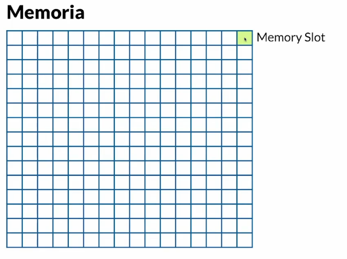
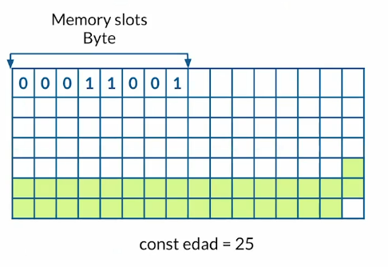
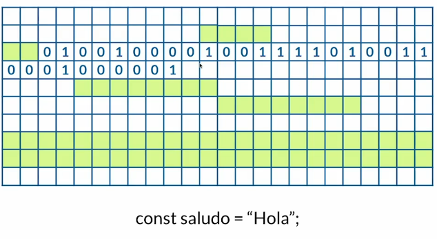
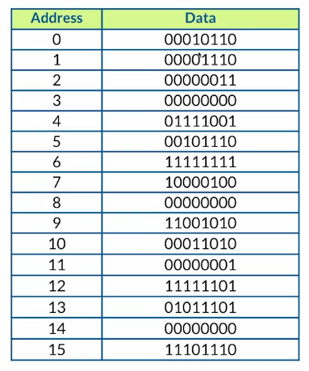
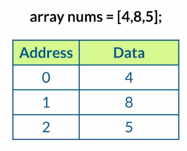
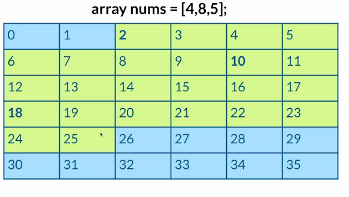
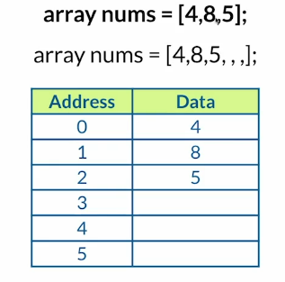
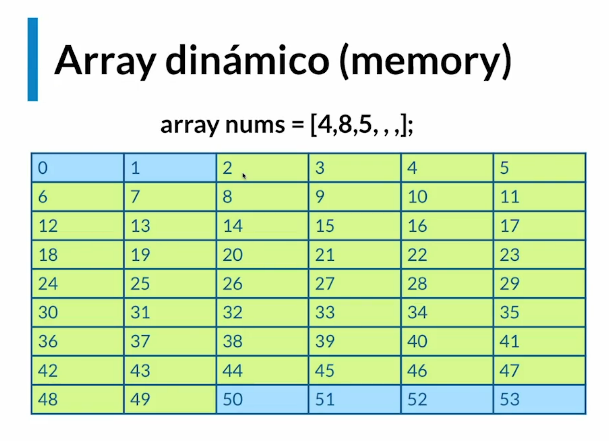
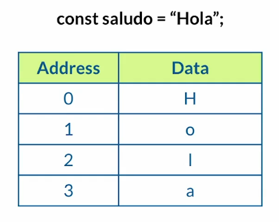
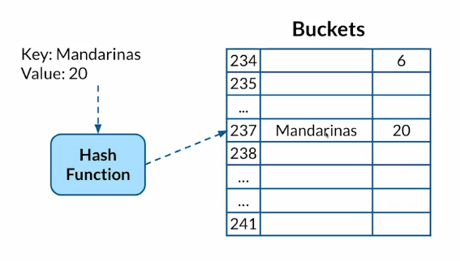

# Que es estructura de datos

- Las estructuras de datos son formas de guardar la información, estos valores que nos ayudan a resolver problemas muy
  especificos.
- Las estructuras de datos son colecciones de valores, las relaciones entre ellos y las funciones u operaciones que se
  pueden aplicar a los datos.
- Otros lenguajes tienen implementado las estructuras de datos.

## Memoria y como guardar datos

- Memory slot son los espacios donde se guardara sierta memoria
  
- En una memoria slot que es un espacio de memoria podemos guardar 1 Byte que son 8 bits.
- Cuando se van guardando los datos en la memoria esto sucede de forma aleatoria nosotros no decidimos donde guardarlo
  lo decide la computadora.
- Sabemos donde esta la información por direcciones
  

- Guardamos la variable saludos con el valor "hola"
  

- Direcciones y su data
  

## Array y String

- Es una estructura de datos
- Los arrays son objetos de tipo lista cuyo prototipo tiene metodos para realizar operaciones de recorrido y
  mutación
- Metodos para manipular un array
    - push
    - pop
    - unshift
    - shift
    - splice
- Existen arrays estaticos y dinamicos
- JavaScript maneja por defecto arrays dinamicos a diferencia de otros lenguajes que se tiene que definir el tamaño de
  array

### Array estatico

- Un array estatico reserva unicamente el tamaño correspendiente al array.

### Array dinamicos

- Un array dinamico reserva el doble de slot en memoria por si llega a crecer. Si nos excedemos de los slots reservados
  inicialmente, la computadora copia el array a un espacio con el doble de tamaño si inicialemente eran 6 ahora seran 12
  y depues de copiar liberara lo reservado inicialemente.
  

## Strings
- Los string en javascript son inmutables que no los podemos cambiar
- Un string se guarda como un array
- No es posible manipular un string cambiar de slot en la memoria seria algo ineficiente.
- 

## Hash Tables
- Hash tables en otros lenguajes
  - Javascript - Object
  - Python - Diccionarios
  - Java - Maps
  - Go - Maps
  - Ruby - Hashes
  - Php - Array clave - valor
- Los hash tables son similares a un objeto porque manejan una llave y un valor
- Como funcionan
 
- Metodos
  - insert - inserta un elemento en la tabla
  - search - Buscar elemento por key
  - delete - Borrar elemento
- Problemas
  - Puede existir un problema que es la colision de elementos. Es imposible saber 

## Linked List
