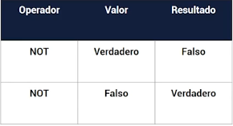
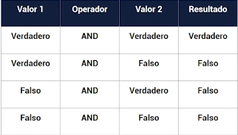

# Conceptos basicos

## Valores

- Valores primitivos
    - Valor tipo numero
        - 40
        - 4.5
    - Valor tipo cadena
        - "Sergio Ochoa"
    - Valor tipo booleano
        - true
        - false
    - Valores vacios(hay que evitarlo)
        - null
        - undefined
- Valores no primitivos o tipo Objeto
    - Valor tipo array
        - [1,2,3]
    - Valor tipo objeto
        - { firstName: "Sergio Antonio" }

### Typeof para saber el tipo de dato

```javascript
// Utilizar en consola
typeof 40
"number"
typeof "Sergio Ochoa"
"string"
typeof true
"boolean"
typeof null
"object"
typeof undefined
"undefined"
typeof [1, 2, 3]
"object"
typeof {name: "Sergio"}
"object"
```

- **Constructor prototype para determinar de que tipo es un objeto**
    - Todos los tipos de datos de objetos derivan de object
    - Object tienen la propiedad constructor. Esta propiedad de constuctor una referencia al objeto en si.

- **Operador instanceof**: Podemos saber de que tipo es siempre y cuando sea un objeto.

## Tipos de datos

- Tipo de datos primitivos
    - boolean: true o false
    - number: integers, decimals, float
    - string: es una serie (arrays) de caracteres
    - Symbols: Sirve como un identificador para las propiedades del objeto
    - undefined: una variable declarada, pero no tiene valor.
    - NaN: (Not a Number) No es un numero
        - Esto sucede cuando tratas de +,-,* o / `"asd"+20`
- Tipo de datos Objecto
    - null: es un objeto especial que indica la ausencia de valor
    - Array []
        - Es una estructura de datos
        - Es un objeto de tipo lista de alto nivel
        - Los arrays son objetos de tipo lista cuyo prototipo tiene metodos para realizar operaciones de recorrido y
          mutación
    - Object {}
        - Un objeto es una coleccion de propiedades(Propiedad es una asociación
          de clave y valor)
        - JavaScript esta diseñado en un paradigma de Objetos
    - Error
        - Contiene el nombre y el mensaje del error
    - Function
        - un bloque de codigo
    - RegExp
        - Una expresion regular
    - Boolean
        - Un objeto que contiene true o false
    - Number
        - Un objeto que contiene un valor numerico
    - String
        - Un objeto que contiene caracteres
- [Data types](../examples/2-basic/1-data-types/README.md)

### String

- https://developer.mozilla.org/es/docs/Web/JavaScript/Reference/Global_Objects/String
- Un objeto que contiene caracteres
- Template literas
    - Las plantillas literales son cadenas literales que habilitan el uso de expresiones incrustadas. Con
      ellas, es posible utilizar cadenas de caracteres de más de una línea, y funcionalidades de interpolación de
      cadenas de caracteres. (https://developer.mozilla.org/es/docs/Web/JavaScript/Reference/Template_literals)
    - Las plantillas literales se delimitan con el caracter de comillas o tildes invertidas (` `)
    - Modificar la salida del las plantillas con los tags personalizados

> **Nota** Boolean, Number, String ocupan un espacio de memoria mas grande y acceder a ellos es mas lento que
> aun dato primitivo.

### Array

#### Map

- .map se lo utiliza para generar un nuevo array transformado
- .map es inmutable por lo tanto no modifica el array original.
- Mantiene el mismo tamaño del array nuevo que se creara

```javascript
const other = array.map(function (element, index, array) {
});
```

#### Filter

- Sirve para crear un nuevo array apartir de los elementos originales mediante una condicion a cumplir
- Es inmutable por lo tanto no modifica el array original.
- Puede retornar ningun elemento, menos elementos o la misma cantidad de elementos siempre y cuando cumplan con la
  condicion.

```javascript
const other = array.filter(function (element, index, array) {
});
```

#### Reduce

- Reduce un array a un solo valor.

```javascript
let reducedValue = array.reduce(function (acumulator, element, index, array) {
}, valorInicial)
```

#### Some

- El método some es inmutable y consiste retornar un valor lógico si existe al menos un elemento que cumpla la
  condición

```javascript
array.some(function (element, index, array) {
});
```

#### Every

- El método every es inmutable y consiste retornar un valor lógico si todos los elementos cumplen con la
  condición.

```javascript
array.every(function (element, index, array) {
});
```

#### Find y FindIndex

- Los métodos find y findIndex consisten en encontrar el primer elemento de un array que cumpla con la condición
- En el caso de find retornará el elemento completo, si cumple con la condición, caso contrario retornará undefined.
- El método findIndex retornará el índice del elemento encontrado, caso contrario retornará -1.

```javascript
array.find(function () {
}, thisArg)
array.findIndex(function () {
}, thisArg)
```

#### includes

- El método includes determina si un array o string incluye un determinado elemento. Devuelve true o false, si existe o
  no respectivamente.
- Este método recibe dos argumentos:
    - El elemento a comparar.
    - El índice inicial desde donde comparar hasta el último elemento.

```javascript
array.includes(searchElement, fromIndex);
```

#### join

- El método join une los elementos del array, mediante una separación, y retorna un string.
- Si un elemento es undefined o null, se convierte en una cadena vacía.
- Este metodo solo recibe un argumento que es el la separacion antes de unirlo.

```javascript
// value is String
const value = array.join(separation);
```

#### split

- El método split de strings, es lo contrario que el método join, consiste en separar un string en substrings, indicando
  un valor a separar. Este método retornará un array de los elementos separados.
- Este método recibe dos argumentos:
    - El separador que especifica el conjunto de caracteres a separar en substrings.
    - El límite de elementos separados a retornar.

```javascript
// values is array
const values = array.split('-');
```

#### concat

- El método concat es inmutable y consiste en crear un nuevo array a partir de la unión de otros valores o arrays
  especificados como argumentos.
- Este método recibe uno o varios argumentos:
    - Valores y/o arrays para concatenar.

```javascript
array.concat(array, String, Number, Object);
```

#### flat

- El método flat es inmutable que consiste en retornar un array donde los sub-arrays han sido aplanados hasta una
  profundidad especificada.
- El aplanamiento consiste en transformar un array de arrays a una sola dimensión.
- Argumento: La profundidad del aplanamiento, por defecto, tiene un valor de 1. Si se desea
  aplanar todos los sub-arrays en una sola dimensión, utiliza el valor de Infinity.

```javascript
array.flat(profundidad);
```

#### flatMap

- El método flatMap es inmutable y consiste en la combinación de los métodos map y flat. Primero realiza la iteración de
  los elementos del array (como si fuera map), y después los aplana en una sola profundidad (como si fuera flat).

#### sort

- El método sort es mutable y consiste en ordenar un array a partir de los valores Unicode de los caracteres y este
  retorna un array con la misma referencia en memoria que el original.
- Recibe un argumento: Una función de comparación que compara cada elemento con otro. Por defecto, evalúa el valor
  Unicode del caracter.

```javascript
let sortedArray = array.sort(function ())
```

### Symbols

- Sirve como un identificador para las propiedades del objeto
- Los simbolos son valores indiscutibles globalmente unicos.
- Ningun simbolo es exactamente el mismo
- Como desarrolladores no tenermos forma de saber cual es el valor unico de un simbolo.
- Cuando utilizas Symbol para crear una propiedad de un objeto este no aparecera en las propiedades del objeto.
- Con los symbols puede crease propiedades ocultas de un objecto

```javascript
let id = Symbol();
let id1 = Symbol("my id");
let id2 = Symbol("my id");
let value = id1 === id2; // false: porque la cadena no es el valor de simbolo.
```

## Variables y constantes

- Para crear variables en javascript se utiliza el formato CamelCase.
- Variable: Espacios en memoria para almacenar un valor
- Las variables tienen que tener nombre significativos
- Una variable no puedo comenzar por numeros
- Una variable no puedo contener espacios y tampoco simbolos especiales
- No deben ser keywords(palabras reservadas)
- keywords para declarar variables
    - `var`
        - No block scope
        - Se puede declarar en cualquier lugar
        - Se puede usar y reasignar en cualquier lugar
    - `let`
        - Block Scope
        - No puede declarar en el mismo scope
        - Se puede reasignar en el mismo scope
    - `const`
        - Block Scope
        - No se pueden reasingar o volver de declarar.
        - Se puede cambiar el valor al que hace referencia la constante solo en arrays, objects y propiedades.
- Desestructuracion: La sintaxis de desestructuración es una expresión de JavaScript que permite desempacar valores de
  arreglos o propiedades de objetos en distintas variables.

- [Ejemplo1](../examples/2-basic/2-variables/README.md)

# Operadores

- [https://developer.mozilla.org/en-US/docs/Web/JavaScript/Guide/Expressions_and_Operators](https://developer.mozilla.org/en-US/docs/Web/JavaScript/Guide/Expressions_and_Operators)

## Operadores Aritmeticos

- En que orden se evaluan las matematicas operaciones complejas
    1. Parentesis
    2. Exponenetes
    3. Multiplicacion/Division
    4. Adición/Sustracción
- Una forma facil de recordar este orden es usando el acronimo PEMDAS
    - Parentesis
    - Exponentes
    - Multiplicación
    - División
    - Adición
    - Sustracción
- Suma `+`
- Resta `-`
- Multiplicación `*`
- División `/`
- Modulo `%` es el restante de una división
- Potencia `**` calcula la potencia de un numero
- [Ejemplo2](../examples/2-basic/3-operadores-aritmeticos/README.md)

## Operadores de comparación

- `==` igual, compara el valor
- `!=` No igual o diferente, compara el valor
- `===` Igual estricto, compara el tipo y el valor
- `!==` No igual estricto, compara el tipo y el valor
- `<` menor que
- `>` mayor que
- `<=` menor o igual que
- `>=` mayor o igual que
- [Ejemplo3](../examples/2-basic/4-operadores-comparacion/README.md)

## Operadores de Asignación

- Un operador de asignación asigna un valor a su operando izquierdo en funcion de su valor de su operando derecho.

```javascript
// Asignación
var x = y;

// Asignacion de Suma
var x
+= y; 	// short
var x = x + y; // full

// Asignacion de resta
var x
-= y; 	//short
var x = x - y; // full

// Asignación de multiplicación
var x
*= y; // short
var x = x * y; // full

// Asignación de División
var x
/= y; // Short 	
var x = x / y; // full

// Asignación de residuo
var x
%= y; // short
var x = x % y; // full

// Asignación de exponenciación
var x
**= y; // short
var x = x ** y; // full

// Asignación a la izquierda
var x
<<= y;
var x = x << y;

// Asignación a la derecha
var x
>>= y;
var x = x >> y;

// Asignación de desplazamiento a la derecha sin firmar
var x
>>>= y;
var x = x >>> y;

// Asignación AND a nivel de bit
var x
&= y;
var x = x & y;

// Asignación XOR a nivel de bit
var x
^= y;
var x = x ^ y;

// Asignación OR a nivel de bit
var x
|= y;
var x = x | y;
```

- [Operadores de asignacion](../examples/2-basic/5-operadores-asignacion/README.md)

## Operadores Logicos

- `!expresión` Realiza una negación en la expresión



- `&&` AND



- `||` OR


- [Operadores logicos](../examples/2-basic/6-opeadores-logicos/README.md)

## Operadores de incremento y decremento

- `++i` Pre incremento
- `i++` Post incremento
- `--i` Pre decremento
- `i--` Post decremento
- [Ejemplo operadores de incremento y decremento](../examples/2-basic/7-operadores-incremento-decremento/README.md)

## Operador Ternario

- El operador tenerario si lo utilizo en java, php, dart y podra utilizarlo en javascript de la misma forma.
- `condition ? (statement if true) : (statement if false);`
- [Ejemplo operador ternario](../examples/2-basic/8-operador-ternario/README.md)

## 'use strict'

- Es ingnorado por navegadores antiguos porque esta entre comillas simples y es manejado como una expresion.
- Forzar que todas la variables sean declaradas, antes de que se usen.
- Las variables mas escritas son creadas en el scope global sino no se usa `use strict`
- Usar **use strict** es una buena practica en JavaScript.
- No puedes crear una variable con palabras reservadas.
- No puedes eliminar una variable con el keyword `delete`
- No puedes elminar una funcion con el keyword `delete`

## Spread operator (Operador de propagación)

- Expande cualquier iterable, como una string o un array dentro de otro array.
- Para pasar multiplos argumentos a una funcion
- La sintaxis es utilizando `...`
- Siempre esta al lado derecho de un signo igual.
- Note: No se tiene soporte en IE y Edge

