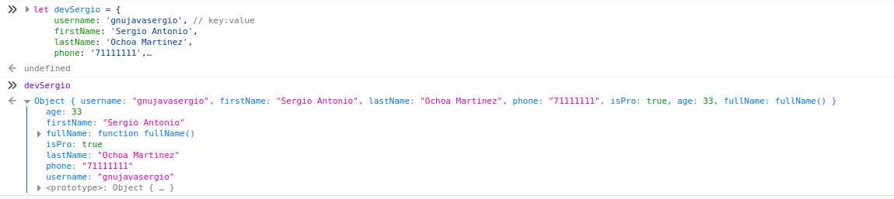
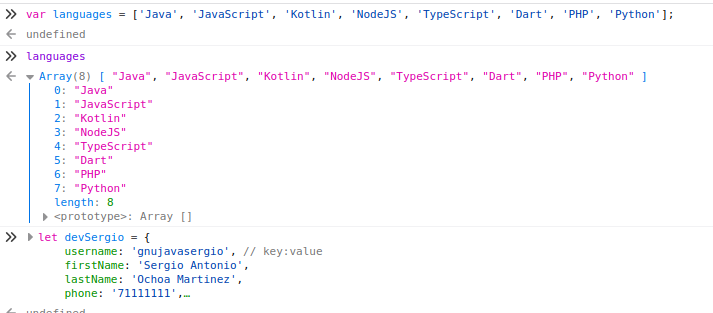
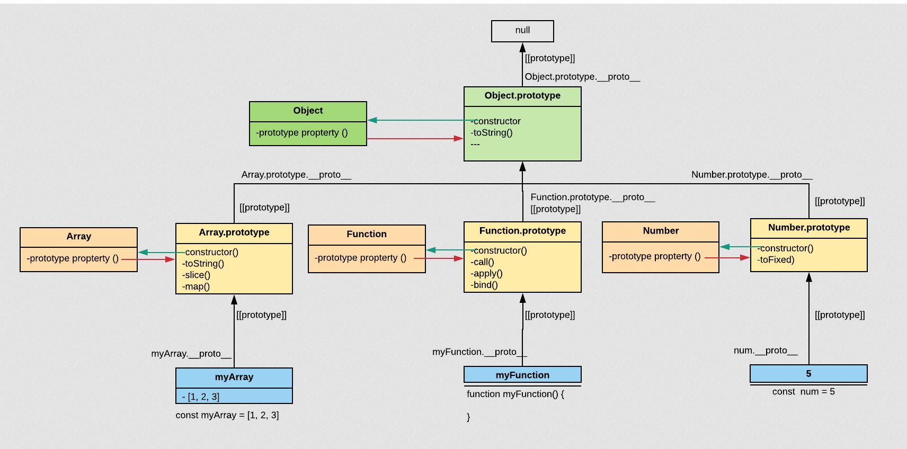
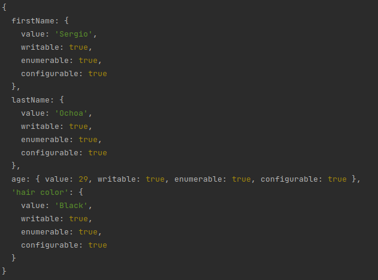

## POO

### Padigmas

- Estructura
- Orientados a Objetos
- Funcional

## Paradigma Orientado a Objetos

- POO se compone de 4 elementos
    - **Clases**: Definida como un esqueleto o un molde que contendra todas las caracteristicas y acciones con las qu se
      puede construir n cantidad de objetos.
    - **Propiedades**: Son las caracteristicas o atributos de una clase es lo que lo describe como por ejemplo
        - Clase Persona
            - Atributos
                - nombre
                - apellido
                - edad
                - fecha de nacmiento
                - Nacionalidad
    - **Metodos**: Son las acciones de una clase lo que puede realizar como por ejemplo
        - Clase Persona
            - Metodos
                - comer
                - caminar
                - jugar
                - respirar
    - **Objetos**: Son aquellos que tienen propiedades y comportamientos y en este caso son la instancia de una clase ya
      son como tal algo especifico, unico.
- POO tiene 4 pilares fundamentales
    - **Abstracción** Con la ayuda de la abstraccion podemos abstraer un conjunto de objetos para poder crear un molde
      un esqueleto
    - **Encapsulamiento**: Nos sirva para encapsular atributos y propiedades para que no puedan ser inviolables o
      inalterables:
      Por Ejemplo una cuenta de banco no puede se cambianda directamente sino se lo tiene que hacer con una accion que
      se encargara de modificar los atributos necesario para que nose modifique equivocadamente algo.
    - **Herencia** Nos permite crear clases a partir de otras la cual es una forma de reutilizar codigo. Reutilizando
      atributos y metodos
    * **Polimorfismo**: Proviene de Poli=muchas, morfismo=formas. Una forma de ver esto es utilizar un metodo con el
      mismo nombre e utilziarlo de varias formas.

## Objetos
- En javascript todo finaliza en prototipo Object
    - Objetos literales
      
    - Arrays
      
    - Instancias de prototipos
    - Prototipo Object
    - Funciones

Prototype chain - https://chamikakasun.medium.com/javascript-prototype-and-prototype-chain-explained-fdc2ec17dd04

- [Ejemplos objects](../examples/5-poo/1-objects-literals/README.md)

### Object literals
- A un objecto puedes acceder a su propiedad con `.` o con `[]`
- Acceder aun objecto con `[]` cuando la propiedad tiene espacios
- Cada propiedad tiene una descripcion que se acceder con el metodo `Object.getOwnPropertyDescriptor(person, 'firstName')`
  - Value
  - writable: Para que la propiedad puedes escribirse
  - enumerable
  - configurable

  
## Clases en javascript con prototipos
- Una clase en javascript con prototipos tiene dos componentes
    - Expresiones
    - Declaraciones
- Herencia con prototipos se utiliza una función
- [Ejemplo Object prototype](../examples/5-poo/2-object-prototype/README.md)

## Clases
- El keyword class fue introducidas en ECMAScript 2015
- Estas son mejoras en sintaxis pero por debajo sigue siento prototipos.
- [Ejemplo de clases](../examples/5-poo/3-clases/README.md)

## Abstracción
- Con la ayuda de la abstraccion podemos abstraer un conjunto de objetos para poder crear un molde
  un esqueleto
- Con ese esqueleto que sera una clase podremos crear n objetos  
- [Ejemplo Abstracción](../examples/5-poo/4-abstraccion/README.md)

## Encapsulamiento
- Esconder metodos y atributos
- No permitir la alteracion de metodos y atributos
- Formas de implementar el encapsulamiento en JS
    - Getters y setters
    - Namespaces
    - Object.defineProperties
    - Modulos de ES6
- [Ejemplo encapsulamiento](../examples/5-poo/5-encapsulamiento/README.md)

## Herencia
- La herencia en una especializacion de una clase y tambien es una forma de refactorizar codigo.
- La herencia en javascript es solo de una clase y no de varias.
- Para implementar la herencia en JavaScript se utiliza la palabra resevada **extends**.
- Para llamar a un metodo o atributo de la clase padre podemos utilizar la palabra reservada **super**.
- [Ejemplo Herencia](../examples/5-poo/6-herencia/README.md)

## Polimorfismo

- Tipos de polimorfismo
    - Sobrecarga: Podemos utilizar un metodo 
    - Parametrico: Podemos tener el el mismo metodo con diferentes tipos de parametros.
    - Inclucion: En JavaScript solo podemos utilizar este tipo de polimorfismo. Lo que nos permite es sobre escribir el metodo que estamos heredando de la clase padre.